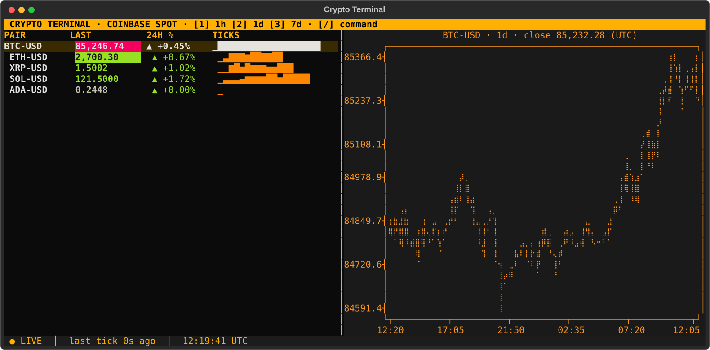

# crypto-terminal

A free, Bloomberg-style crypto terminal that runs in your shell. Live spot prices stream straight from the Coinbase Exchange public websocket: no API key, no account, no polling.



 

## Features

- **Live watchlist**: last price, 24h change, and a sparkline of recent ticks. Prices flash green/red on every up/down tick.
- **Chart pane**: price history for the highlighted pair over 1h, 1d or 7d (Coinbase candles).
- **Command bar**: add and remove pairs; the watchlist is saved to `watchlist.json`.
- **Status line**: connection state, time since the last tick, UTC clock. Shows `STALE` after 10s without data and reconnects automatically with exponential backoff.

Default pairs: BTC-USD, ETH-USD, XRP-USD, SOL-USD, ADA-USD. Any Coinbase spot pair works.

## Setup

Requires Python 3.10+.

```bash
git clone https://github.com/owen-alderson/crypto-portfolio-dashboard.git
cd crypto-portfolio-dashboard
python3 -m venv .venv
source .venv/bin/activate
pip install -r requirements.txt
python -m terminal
```

## Keys

| Key | Action |
|---|---|
| `↑` `↓` | Select pair (chart follows) |
| `1` `2` `3` | Chart timeframe: 1h, 1d, 7d |
| `/` or `:` | Open command bar (`esc` closes it) |
| `ctrl+q` | Quit |

## Commands

| Command | Effect |
|---|---|
| `add SOL-USD` | Add a pair (checked against Coinbase first) |
| `rm ADA-USD` | Remove a pair |
| `quit` | Exit |

## Architecture

```
terminal/
  feed.py      websocket client: subscribes to ticker + heartbeat, validates each message,
               reconnects with exponential backoff (1s → 30s); 30s of silence = dead socket
  history.py   REST: candles for the chart, product lookup for `add`
  widgets.py   PriceTable (watchlist) and ChartPane (textual-plotext)
  app.py       Textual app: layout, command parsing, watchlist persistence, status line
tests/         pytest: message + command parsing, reconnect against a local websocket
               server, headless UI tests with Textual's Pilot (no internet needed)
```

The feed and the chart fetch run as Textual async workers; changing the watchlist restarts the feed worker, and a new chart request cancels the previous one so a slow response can't draw the wrong pair.

## Tests

```bash
pytest
```

## History

This repo started as a Streamlit + CoinGecko portfolio dashboard that polled every 60s. That version is preserved at the `v1-streamlit` tag (`git checkout v1-streamlit`).
